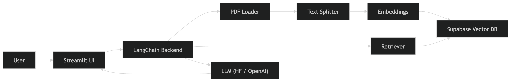

# 🧠 RAGify — Chat with Your Documents using AI

A **Retrieval-Augmented Generation (RAG)** system that allows users to upload PDFs and interact with them through natural language queries. The system retrieves relevant document context and generates accurate answers with source citations.

---

## 🚀 Features

- 📄 Upload and index PDF documents  
- 💬 Chat with your documents in real-time  
- 🔍 Semantic search using vector embeddings  
- 📌 Source-based answers (file + page reference)  
- 🔄 Supports multiple LLM providers:
  - HuggingFace (free)
  - OpenAI (optional)
- 🗄️ Persistent vector storage using Supabase (pgvector)  
- ⚡ Fast and modular LangChain-based pipeline  
- 🎨 Clean and modern Streamlit UI  

---

## 🏗️ Architecture



---

## 🧩 Tech Stack

### Frontend
- Streamlit  

### Backend
- Python  
- LangChain  

### LLM
- HuggingFace (Qwen)  
- OpenAI (gpt-4o-mini)  

### Embeddings
- sentence-transformers/all-MiniLM-L6-v2  

### Vector Database
- Supabase (PostgreSQL + pgvector)  

### Document Processing
- PyPDF  

---

## ⚙️ How It Works

RAGify follows the **Retrieval-Augmented Generation (RAG)** approach:

1. 📥 Upload PDF documents  
2. ✂️ Split into smaller chunks  
3. 🧠 Convert chunks into embeddings  
4. 🗄️ Store embeddings in vector database  
5. ❓ User asks a question  
6. 🔍 Retrieve relevant chunks  
7. 🤖 LLM generates answer based on context  

👉 This ensures **accurate, context-aware, and hallucination-free responses**.

---

## 📦 Installation

```bash
git clone https://github.com/satvik078/RAGify.git
cd RAGify
pip install -r requirements.txt

---

## 🔑 Environment Setup

Create a .env file:

HF_API_KEY=your_huggingface_key
OPENAI_API_KEY=your_openai_key   # optional
SUPABASE_URL=your_url
SUPABASE_KEY=your_key

## ▶️ Run the App

streamlit run app.py

### Open in browser:

http://localhost:8501

---

## 🔄 Dynamic Model Selection

RAGify automatically selects the model based on API key:

API Key	Provider	Model
hf_...	HuggingFace	Qwen 
sk-...	OpenAI	GPT-4o-mini

---

## 📁 Project Structure

RAGify/
├── app.py
├── config.py
├── requirements.txt
├── backend/
│   ├── document_loader.py
│   ├── text_splitter.py
│   ├── embeddings.py
│   ├── vector_store.py
│   ├── llm.py
│   └── rag_chain.py
├── data/uploads/
└── assets/
```
---

## 🎯 Use Cases

📊 Company document Q&A
📚 Research paper assistant
🏢 Internal knowledge base
📄 Policy & compliance search
🤖 AI-powered document chatbot

---

## Limitations

Free API usage has rate limits
Large PDFs may slow indexing
Single-user session (for now)

---

## 🔮 Future Improvements

Multi-user support
Chat history persistence
Support for DOCX / PPTX
Better caching & performance
Deployment scaling

---

## 🤝 Contributing

Contributions are welcome!
Feel free to open issues or submit pull requests.

---

## 📜 License

MIT License

---

## ⭐ Show Your Support

If you like this project:

⭐ Star the repo
🍴 Fork it
📢 Share it

---

## 👨‍💻 Author

Satvik Pandey
